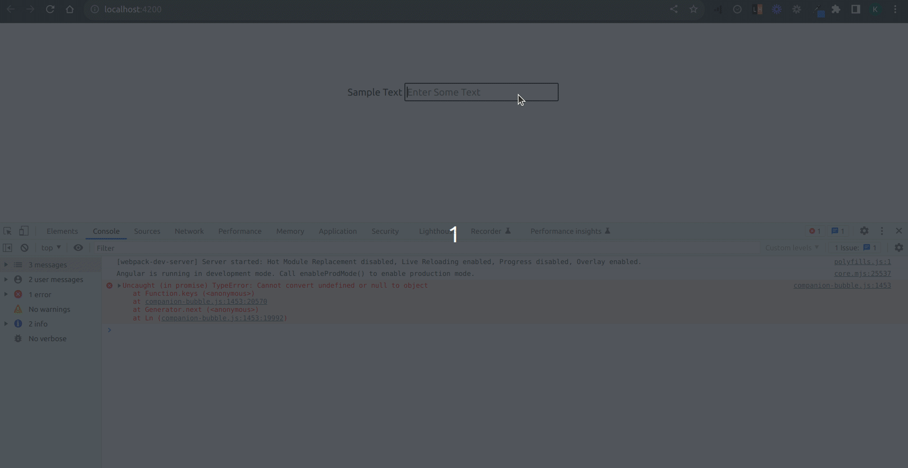

# AngularPracticeExerciseScenario1

This project was generated with [Angular CLI](https://github.com/angular/angular-cli) version 14.2.1.

---

# Sample Output


---

## Steps to replicate the Output
---

1. Clone the repository
2. Install Node modules using the following command:
```
npm install
```
3. Run the development server using the following command:

```
ng serve -o
```
---