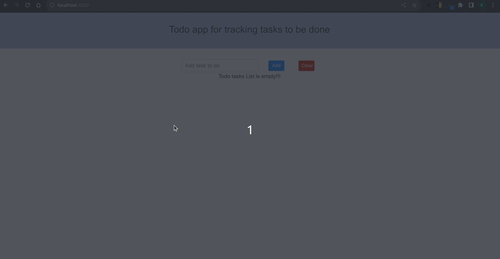
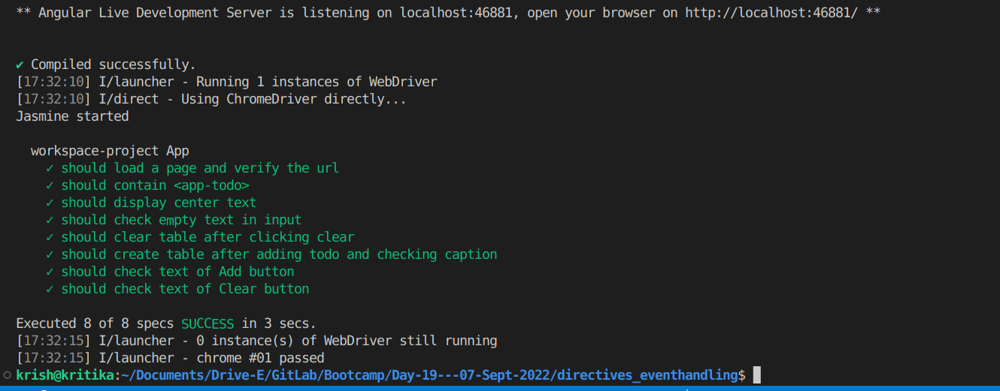
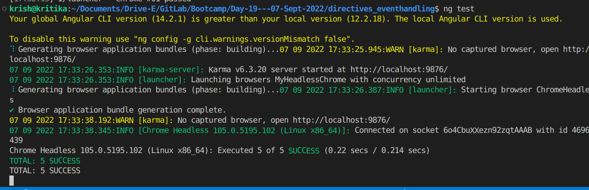

# Todo app

## Problem Statement

Todo app is to keep track of the tasks to be completed.We can add the task to be performed and can mark it as done.

---
## Solution
---


---
## E2E Test report
---


---
## Test Report
---


---
## Steps to run folder locally

---
1. Clone the repository.
2. Install node modules

```
npm install --save --legacy-peer-deps
```
3. Start development server

```
npm run start
```
4. Run tests

```
ng test
ng e2e
```
---