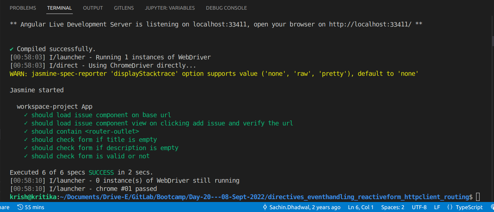
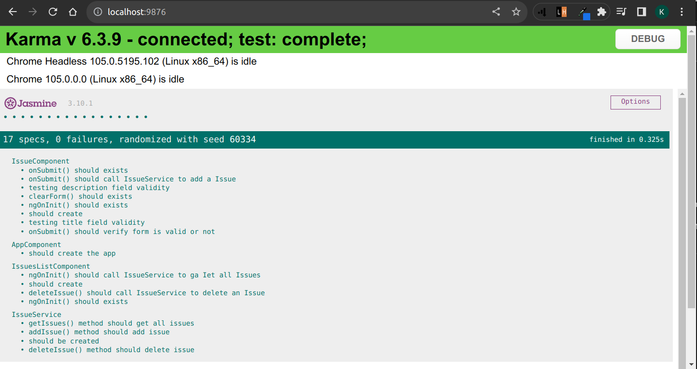

# SEED CODE - BOILERPLATE

## Solution
---

## Test Report

## E2E Test Report

## INSTRUCTIONS

Refer the problem.md file for problem description.

### To use this as a boilerplate for your assessment, please follow these steps

1. **FORK** this repository in your Gitlab account

2. **CLONE** the forked repository, containing the boilerplate in your local machine

3. After Cloning the boilerplate repository then cd into it

4. Complete the solution as per the instructions given in problem.md and the boilerplate code

5. Use the following command to update the index using the current content found in the working tree, to prepare the content staged for the next commit.

     `git add .`

6. Commit and Push the project to git

     `git commit -a -m "Initial commit | or place your comments according to your need"`

     `git push -u origin master`

7. Check on the git repo online, if the files have been pushed

8. Submit your solution on Hobbes

## IMPORTANT INSTRUCTIONS FOR PARTICIPANTS

> - We expect you to write the solution of this assignment on your own by following through the guidelines
> - The code must not be plagiarized, the mentors will randomly pick the submissions and may ask you to explain the solution
> - The code must be properly indented, code structure maintained as per the boilerplate and properly commented
> - Follow through the problem statement shared with you
> - Use `ng test` for testing unit tests
> - Use `ng e2e` for testing integration tests

## MENTORS TO BEGIN REVIEW YOUR WORK ONLY AFTER

> - You add the respective Mentor as a Reporter/Master into your Assignment Repository
> - You have checked your Assessment on the Automated Evaluation Tool - Hobbes (Check for necessary steps in your Boilerplate - README.md file. ) and got the required score - Check with your mentor about the Score you must achieve before it is accepted for Manual Submission.