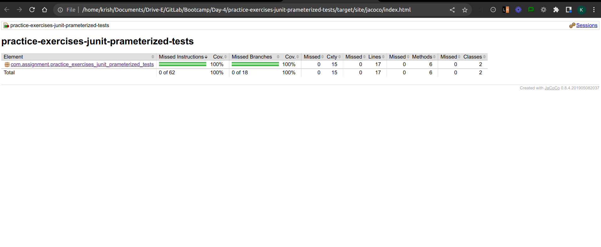

# Practice Exercise for Junit Parameterized Tests

## Problem Statement

Write a Java code to do the following

1. Create a class Calculate Create a method int addSum(int a, int b); boolean isEven(int num);

2. Create a class StringManipulation and create a method int vowelCount(String name); int characterCount(String str);

## Expected Solution

Write a Prameterized Testcases using Junit to the above methods for both positive and negative Scenarios.

## Code Coverage

